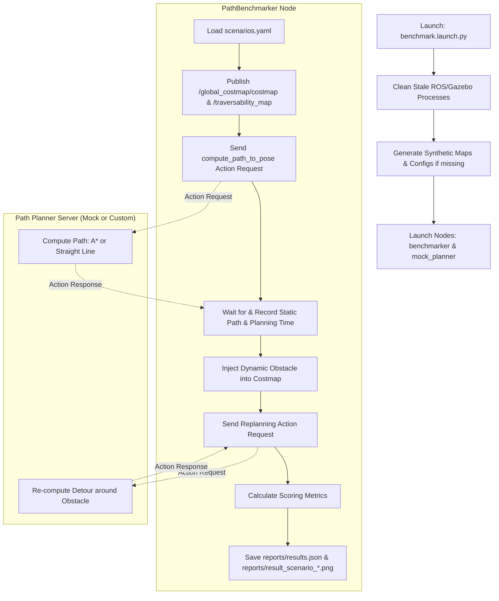

# ROS 2 Global Path Planning Benchmarking Suite

An automated, standalone, black-box benchmarking harness designed for evaluating ROS 2 global path planning nodes. This system mimics real-world rover operations (inspired by the **European Rover Challenge (ERC)** Marsyard and the **BARN Challenge**) by assessing planners on navigation speed, safety margins, route optimality, cost map traversal, and dynamic replanning.

---

## 🗺️ System Architecture & Workflow

The benchmarking suite runs as an autonomous wrapper around any path planner supporting the Nav2 action interface. 

### Logical Flow



---

## 📊 Benchmarking Metrics & Scoring

The **Final Path Planning Score** is evaluated out of **100 points** based on six weighted performance indicators:

$$\text{Planning Score} = 0.25 \cdot S_{\text{success}} + 0.15 \cdot S_{\text{time}} + 0.25 \cdot S_{\text{obstacle}} + 0.15 \cdot S_{\text{cost}} + 0.10 \cdot S_{\text{length}} + 0.10 \cdot S_{\text{replan}}$$

### Sub-Score Details

| Metric | Code Variable | Weight | Target | Mathematical Formula / Condition |
| :--- | :--- | :--- | :--- | :--- |
| **Planning Success** | $S_{\text{success}}$ | 25% | Path found | $100$ if path returned successfully; $0$ on failure or timeout. |
| **Planning Time** | $S_{\text{time}}$ | 15% | $\le 2.0\text{ s}$ | $T \le 2.0\text{s} \implies 100$<br>$T \ge 10.0\text{s} \implies 0$<br>Else: $100 \cdot \left(1 - \frac{T - 2.0}{8.0}\right)$ |
| **Obstacle Avoidance** | $S_{\text{obstacle}}$ | 25% | $0$ Collisions | $100$ if robot swept footprint radius never intersects obstacle cell ($\text{cost} \ge 100$); else $0$. |
| **Path Cost** | $S_{\text{cost}}$ | 15% | Minimized | $100 - C_{\text{avg}}$, where $C_{\text{avg}}$ is the mean cost value of the traversed grid cells. |
| **Path Length Ratio** | $S_{\text{length}}$ | 10% | $\le 1.0\times$ reference | $R = \frac{\text{Planned Length}}{\text{Reference Length}}$<br>$R \le 1.0 \implies 100$<br>$R \ge 1.35 \implies 0$<br>Else: $100 \cdot \left(1 - \frac{R - 1.0}{0.35}\right)$ |
| **Replanning detours**| $S_{\text{replan}}$ | 10% | $\le 2.0\text{ s}$ detour | $100$ if new path found avoiding dynamic obstacle in $\le 2.0\text{s}$; else $0$. |

---

## 📂 Repository Structure

```text
testing/
├── Global_path_benchmarking/
│   ├── config/
│   │   └── scenarios.yaml          # Scenario template file
│   ├── global_path_benchmarking/
│   │   ├── __init__.py
│   │   ├── benchmarker.py          # Core benchmarking node, publisher & metric scorer
│   │   └── mock_planner.py         # Mock planner Action Server (Straight Line & A*)
│   ├── launch/
│   │   └── benchmark.launch.py     # Setup, cleanup, and parameters launcher
│   ├── package.xml                 # ROS 2 package metadata
│   ├── setup.cfg
│   ├── setup.py                    # ROS 2 build entries
│   └── README.md                   # Package-specific documentation
│
├── config/
│   └── scenarios.yaml              # Active workspace scenarios configurations
├── maps/                           # Workspace maps (PNG files & NumPy elevation arrays)
├── reports/                        # JSON performance logs and path comparison plots
├── Refrence data/                  # Original contest rules and reference criteria PDFs
```

---

## 🚀 Quick Start Guide

### 1. Prerequisites
Ensure you have a ROS 2 Humble desktop installation running on Ubuntu 22.04 with standard development libraries (`colcon`, `pip`, `numpy`, `matplotlib`, `pillow`, `pyyaml`).

### 2. Compile the Workspace
Navigate to your workspace directory and compile:

```bash
cd ~/Desktop/testing
colcon build --packages-select global_path_benchmarking
source install/setup.bash
```

### 3. Step-by-Step Execution

#### Step A: Pre-Run Path Verification
Verify your reference paths and robot safety footprints before running a test. This generates verification plots in `reports/`:
```bash
ros2 launch global_path_benchmarking benchmark.launch.py verify:=true
```

#### Step B: Run the Benchmark with A* Mock Planner (Expected: High Score)
Evaluates the benchmark using a safe, path-finding grid search planner:
```bash
ros2 launch global_path_benchmarking benchmark.launch.py
```

#### Step C: Run the Benchmark with Straight-Line Planner (Expected: Low Score / Collisions)
Evaluates a planner that directly drives toward the goal, failing safety sweeps:
```bash
ros2 launch global_path_benchmarking benchmark.launch.py use_astar:=false
```

#### Step D: Run a Specific Scenario
Run only a single test scenario (e.g. `canyon_gate_passage`) and force-kill lingering nodes first:
```bash
ros2 launch global_path_benchmarking benchmark.launch.py scenario_id:=canyon_gate_passage clean:=true
```

---

## 🛠️ Configuration & Customization

### Modifying Scenarios (`config/scenarios.yaml`)
You can define custom maps, coordinates, reference paths, and dynamic obstacle triggers:

```yaml
scenarios:
  - id: "my_marsyard_run"
    map_image: "maps/crater_yard.png"        # Path to map image
    resolution: 0.05                         # Meters/pixel
    origin: [-10.0, -10.0]                   # Grid bottom-left coordinate
    robot_radius: 0.35                       # Rover safety radius footprint (m)
    start: [-5.0, -5.0]                      # X, Y starting pose
    goal: [5.0, 5.0]                         # X, Y goal pose
    reference_path:                          # Ordered list of coordinates (optimal path)
      - [-5.0, -5.0]
      - [0.0, 0.0]
      - [5.0, 5.0]
    dynamic_obstacles:                       # Obstacles to spawn mid-planning
      - trigger_time: 1.0                    # Seconds after initial query
        x: 0.0                               # Spawning X coordinate
        y: 0.0                               # Spawning Y coordinate
        radius: 0.6                          # Obstacle radius in meters
```

---

## 🔌 Swapping in a Custom Planner

To test your own global path planner:

1. **Verify Interfaces**: Ensure your planner hosts a standard Nav2 Action Server at the topic `compute_path_to_pose` using the action type `nav2_msgs/action/ComputePathToPose`.
2. **Start Your Planner**: Run your custom planner node independently.
3. **Execute the Benchmarker**: Run the benchmark node directly:
   ```bash
   ros2 run global_path_benchmarking benchmarker --config config/scenarios.yaml
   ```
4. Check `reports/results.json` and generated PNGs to inspect your path planner's safety scores and detour efficiency.
