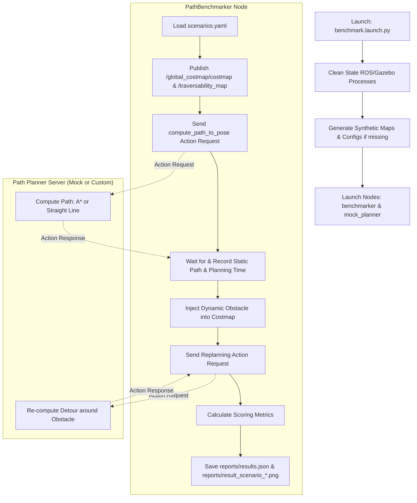

# ROS 2 Global Path Planning Benchmarking Suite

An automated, standalone, black-box benchmarking harness designed for evaluating ROS 2 global path planning nodes. This system mimics real-world rover operations (inspired by the **European Rover Challenge (ERC)** Marsyard and the **BARN Challenge**) by assessing planners on navigation speed, safety margins, route optimality, cost map traversal, and dynamic replanning.

---

## 🗺️ System Architecture & Workflow

The benchmarking suite runs as an autonomous wrapper around any path planner supporting the Nav2 action interface. 

### Logical Flow



---

## 📊 Benchmarking Metrics & Scoring

To achieve a **PASS** outcome, the planner must obtain a weighted score of **$\ge$ 85.0 / 100**. The score is evaluated based on six performance indicators:

$$\text{Planning Score} = 0.25 \cdot S_{\text{success}} + 0.15 \cdot S_{\text{time}} + 0.25 \cdot S_{\text{obstacle}} + 0.15 \cdot S_{\text{cost}} + 0.10 \cdot S_{\text{length}} + 0.10 \cdot S_{\text{replan}}$$

### Sub-Score Details

| Metric | Code Variable | Weight | Target | Mathematical Formula / Condition |
| :--- | :--- | :--- | :--- | :--- |
| **Planning Success** | $S_{\text{success}}$ | 25% | Path found | $100$ if path returned successfully; $0$ on failure or timeout. |
| **Planning Time** | $S_{\text{time}}$ | 15% | $\le 2.0\text{ s}$ | $T \le 2.0\text{s} \implies 100$<br>$T \ge 10.0\text{s} \implies 0$<br>Else: $100 \cdot \left(1 - \frac{T - 2.0}{8.0}\right)$ |
| **Obstacle Avoidance** | $S_{\text{obstacle}}$ | 25% | $0$ Collisions | $100$ if robot swept footprint radius never intersects obstacle cell ($\text{cost} \ge 100$); else $0$. |
| **Path Cost** | $S_{\text{cost}}$ | 15% | Minimized | $100 - C_{\text{avg}}$, where $C_{\text{avg}}$ is the mean cost value of the traversed grid cells. |
| **Path Length Ratio** | $S_{\text{length}}$ | 10% | $\le 1.0\times$ reference | $R = \frac{\text{Planned Length}}{\text{Reference Length}}$<br>$R \le 1.0 \implies 100$<br>$R \ge 1.35 \implies 0$<br>Else: $100 \cdot \left(1 - \frac{R - 1.0}{0.35}\right)$ |
| **Replanning detours**| $S_{\text{replan}}$ | 10% | $\le 2.0\text{ s}$ detour | $100$ if new path found avoiding dynamic obstacle in $\le 2.0\text{s}$; else $0$. |

---

## 🗺️ Test Scenarios

The suite includes **9 pre-configured test scenarios** spanning simple baselines and complex navigation challenges:

1. **`empty_straight`**: Straight-line path in open field (tests basic connection).
2. **`scattered_rocks_detour`**: Multiple static rocks. Spawns a dynamic obstacle mid-run to test detour re-planning.
3. **`canyon_gate_passage`**: Navigates through a narrow gateway corridor.
4. **`marsyard_rough_slopes` [HARD]**: Injects high-cost gray zones representing slopes. Planners must detour around them to maintain low path cost.
5. **`marsyard_labyrinth` [HARD]**: A winding maze of walls. Tests footprint safety limits (planners without obstacle inflation will collide in corridors).
6. **`canyon_gate_blocked` [HARD]**: Spawns a large dynamic obstacle that completely closes off the passage, testing failure handling and abort latency.
7. **`marsyard_snake_passage` [HARD]**: A tight S-curve winding channel. Tests path smoothing and fine resolution collision checking.
8. **`dead_end_trap` [HARD]**: A U-shaped pocket blocking the goal. Tests heuristic trap escape (planners must route backward to find the exit).
9. **`crater_field` [HARD]**: Dense field of scattered variable-slope cost zones (gray values 140–180), evaluating cost-aware trajectory weaving.

---

## 🧼 Automatic Cleanliness & Dynamic Reporting

* **Stale Log & Report Purging**: Before starting a benchmark or verification run, the suite automatically deletes all stale report files (`results.json`, `numerical_report.md`, `numerical_report.pdf`, and `result_scenario_*.png` plots) from previous executions.
* **Single-Scenario Filtering**: When running a single targeted scenario (using `scenario_id:=<id>`), the generated PDF and Markdown reports dynamically filter and adjust to display metrics and plots for *only* that active test run.

---

## 📂 Repository Structure

```text
testing/
├── Global_path_benchmarking/
│   ├── config/
│   │   └── scenarios.yaml          # Template configurations share directory
│   ├── global_path_benchmarking/
│   │   ├── __init__.py
│   │   ├── benchmarker.py          # Core benchmarking node, publishers, and report engine
│   │   └── mock_planner.py         # Mock action server (Straight Line & A*)
│   ├── launch/
│   │   └── benchmark.launch.py     # Supervisor launch launcher
│   ├── package.xml                 # ROS 2 manifest file
│   ├── setup.cfg
│   ├── setup.py                    # installation configuration
│   └── README.md                   # Package instructions
│
├── config/
│   └── scenarios.yaml              # Active scenario coordinates mapping
├── maps/                           # PNG maps & NumPy elevation maps (auto-generated)
├── reports/                        # Compiled JSON, Markdown, PDF reports, and comparison PNGs
├── Refrence data/                  # Standard contest constraints reference documents
└── ROS2_Path_Planning_Benchmarking_Manual.pdf   # Complete Technical Manual
```

---

## 🚀 Quick Start Guide

### 1. Prerequisites
Ensure you have a ROS 2 Humble installation running on Ubuntu 22.04 with standard development libraries (`colcon`, `pip`, `numpy`, `matplotlib`, `pillow`, `pyyaml`, `reportlab`).

### 2. Compile the Workspace
Navigate to your workspace directory and compile:

```bash
cd ~/Desktop/testing
colcon build --packages-select global_path_benchmarking
source install/setup.bash
```

### 3. Step-by-Step Execution

#### Step A: Pre-Run Path Verification
Verify your reference paths and robot safety footprints before running a test. This generates verification plots in `reports/`:
```bash
ros2 launch global_path_benchmarking benchmark.launch.py verify:=true
```

#### Step B: Run the Full Benchmark Suite (A* Mock Planner)
Evaluates all 9 scenarios, compiling console logs, Markdown summary, and the publication-ready PDF:
```bash
ros2 launch global_path_benchmarking benchmark.launch.py
```

#### Step C: Run the Benchmark with Straight-Line Planner
Evaluates a planner that directly drives toward the goal, highlighting collision failures:
```bash
ros2 launch global_path_benchmarking benchmark.launch.py use_astar:=false
```

#### Step D: Run a Specific Scenario with System Cleanup
Run only a single test scenario (e.g. `crater_field`) and automatically purge stale files:
```bash
ros2 launch global_path_benchmarking benchmark.launch.py scenario_id:=crater_field clean:=true
```

---

## 🔌 Swapping in a Custom Planner

To test your own global path planner:

1. **Verify Interfaces**: Ensure your planner hosts a standard Nav2 Action Server at the topic `compute_path_to_pose` using the action type `nav2_msgs/action/ComputePathToPose`.
2. **Start Your Planner**: Run your custom planner node independently.
3. **Execute the Benchmarker**: Run the benchmark node directly pointing it to the yaml configurations:
   ```bash
   ros2 run global_path_benchmarking benchmarker --config config/scenarios.yaml
   ```
4. Check `reports/numerical_report.pdf` to inspect your path planner's safety scores, pass/fail status, and detour efficiency.
